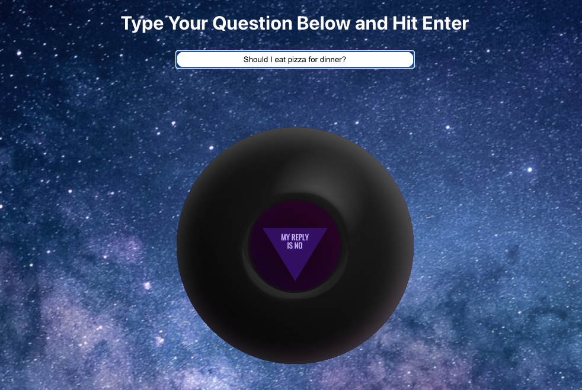

# Magic Eight Ball

Users are able to enter a question and receive an answer fetched from the [Magic Eight Ball API](https://8ball.delegator.com/). The app will also keep track of the questions asked during a session and the corresponding answers and print them below the eight ball. 

Magic Eight Ball CSS can be found [here](https://codepen.io/rockhill/pen/EtKsv).

## Screenshots

